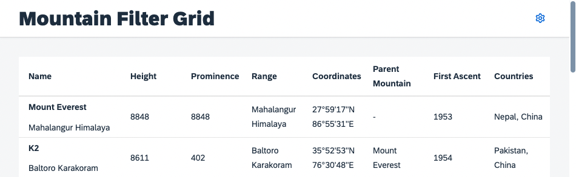
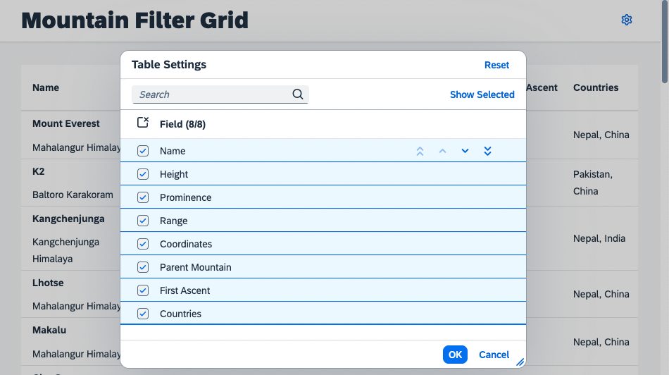

# Engine Registration for Table
Having established the custom control, you can start adding personalization capabilities by making use of the `sap.m.p13n.Engine`.
## Load the Dependencies
Require the dependencies in `P13nTable.ts`. Add the following modules and their imports:

````ts
import Engine from "sap/m/p13n/Engine"
import SelectionController, { SelectionState } from "sap/m/p13n/SelectionController"
import MetadataHelper, { MetadataObject } from "sap/m/p13n/MetadataHelper"
import Column from "sap/m/Column"
import Text from "sap/m/Text"
import Event from "sap/ui/base/Event"
import Control from "sap/ui/core/Control"
import ColumnListItem from "sap/m/ColumnListItem"
````
## Required Modules
* [`sap.m.p13n.Engine`](https://openui5nightly.hana.ondemand.com/api/sap.m.p13n.Engine): The central artifact and API for application/control development. Since the Engine is a static artifact, you need to ensure that control instances are registered to it.
* [`sap.m.p13n.SelectionController`](https://openui5nightly.hana.ondemand.com/api/sap.m.p13n.SelectionController): A basic controller that allows to manage the state of control aggregations. It detects changes like adding, removing and reordering the aggregation's items. It also provides the UI for personalization.
* [`sap.m.p13n.MetadataHelper`](https://openui5nightly.hana.ondemand.com/api/sap.m.p13n.MetadataHelper): Serves as an interface to fetch required metadata for the Controller, so that the dialog and the according selection can be performed properly.

## Register the Table
Register the `P13nTable` to the `Engine`. Pass the control instance, the metadata provided via the helper, and the desired controllers. As the binding path should be part of the metadata you have to register to `updateFinished` event of the `P13nTable`. This way it is ensured that certain binding related information is available when needed.

````ts
export default class P13nTable extends Table {
	static renderer: string = "sap/m/TableRenderer"

	private initialized: Promise<void>

	private helper: MetadataHelper

	private engine: Engine


	constructor(id?: string, settings?: $TableSettings) {
		super(id, settings)
		this.engine = Engine.getInstance()
		this.initialized = new Promise((resolve: () => void): void => {
			this.attachEventOnce("updateFinished", (): void => {
				this.initP13n()
				resolve()
			}, this)
		})
	}
}
````

As next step add the `initP13n` function to the `P13nTable`. This method should only be called once to initialize the personalization by registering the `Table` instance to the `Engine` using [`Engine#register`](https://openui5nightly.hana.ondemand.com/api/sap.m.p13n.Engine#methods/register). The `SelectionController` should manage the visibility and order of columns.

So that the `Engine` can work with the metadata, there is a `MetadataHelper` that supports you in providing the metadata in the required format and serves as an interface between `Engine` and your service metadata.

>**Note**: The metadata passed to the helper needs to be *serializable*, as it might be stored in a persistence later. Furthermore you should not add *personal* or *protected* information, as it could be retrieved by anyone with access to the persistency.

The metadata should contain the following properties:
- `key`: Used to identify the according item and by default associated with the corresponding control ID, in this case we use custom data that is added to the columns.
- `label`: Displayed in personalization popups to display the corresponding item.

The `path` is optional and contains the binding path for later usage.  Very likely the metadata for your application is available in a different format, so this is just an example of how it can be done. You might need to do it differently in your productive scenario:

````ts
export default class P13nTable extends Table {

	[...] // constructor logic

	private initP13n(): void {
		const columns: Column[] = this.getColumns()
		const columnsMetadata: MetadataObject[] = columns.map((column: Column, index: number) => {
			const columnHeader = column.getHeader() as Text
			const columnListItem: ColumnListItem = this.getItems()[0] as ColumnListItem
			const innerControl = columnListItem.getCells()[index]
			return {
				key: column.data("p13nKey"),
				label: columnHeader.getText(false),
				path: innerControl.getBinding(innerControl.isA("sap.m.ObjectIdentifier") ? "title" : "text").getPath()
			}
		})

		this.helper = new MetadataHelper(columnsMetadata)

		this.engine.register(this, {
			helper: this.helper,
			controller: {
				Columns: new SelectionController({
					control: this,
					targetAggregation: "columns"
				})
			}
		})
	}
}
````

The `Engine#register` retrieves an object with configuration parameters as second argument:
- `helper`: The helper defines which metadata is available, for example to allow displaying it in personalization Popups (e.g. the label).
- `controller`: The registry of controllers with an arbitrary name `Columns` for the `SelectionController` instance. The name is up to the developer.

>**Note**: The `columns` aggregation of the table is now managed by the `SelectionController`. This means there should be *no alteration* of the `columns` aggregation via the usual API (e.g. `addColumn`, `removeColumn`...) as this would lead to conflicts with the internal mechanisms. Only that way the Engine can act as central management for state and persistence.

## Add Flexibility

To enable the personalization flexibility needs to be added to the `P13nTable`, this can be done in the `Mountains.view.xml` file. Add the following namespaces:

````xml
<mvc:View
	height="100%"
	displayBlock="true"
	xmlns:mvc="sap.ui.core.mvc"
	xmlns="sap.m"
	xmlns:f="sap.f"
	xmlns:core="sap.ui.core"
	xmlns:ctl="sample.p13n.app.control"
	controllerName="sample.p13n.app.controller.Mountains"
	xmlns:sap.ui.fl="sap.ui.fl"
	xmlns:custom.data="http://schemas.sap.com/sapui5/extension/sap.ui.core.CustomData/1">
````

`sap.ui.fl` contains the flexibility which enables state updates to be made on the `P13nTable`.
`custom.data` will be used to identify the columns more easily.

Now replace the `P13nTable` implementation:

````xml
<ctl:P13nTable
	id="table"
	inset="false"
	items="{mountains>/mountains}"
	sap.ui.fl:flexibility="sap/m/flexibility/EngineFlex">
	<ctl:columns>
		<Column
			id="name"
			width="12em"
			custom.data:p13nKey="name">
			<Text text="Name"/>
		</Column>
		<Column
			id="height"
			minScreenWidth="Tablet"
			demandPopin="true"
			custom.data:p13nKey="height">
			<Text text="Height" />
		</Column>
		<Column
			id="prominence"
			minScreenWidth="Tablet"
			demandPopin="true"
			custom.data:p13nKey="prominence">
			<Text text="Prominence" />
		</Column>
		<Column
			id="range"
			minScreenWidth="Tablet"
			demandPopin="true"
			custom.data:p13nKey="range">
			<Text text="Range" />
		</Column>
		<Column
			id="coordinates"
			minScreenWidth="Tablet"
			demandPopin="true"
			custom.data:p13nKey="coordinates">
			<Text text="Coordinates" />
		</Column>
		<Column
			id="parent_mountain"
			minScreenWidth="Tablet"
			demandPopin="true"
			custom.data:p13nKey="parent_mountain">
			<Text text="Parent Mountain" />
		</Column>
		<Column
			id="first_ascent"
			minScreenWidth="Tablet"
			demandPopin="true"
			custom.data:p13nKey="first_ascent">
			<Text text="First Ascent" />
		</Column>
		<Column
			id="countries"
			minScreenWidth="Tablet"
			demandPopin="true"
			custom.data:p13nKey="countries">
			<Text text="Countries" />
		</Column>
	</ctl:columns>
	<ctl:items>
		<ColumnListItem vAlign="Middle">
			<cells>
				<ObjectIdentifier
					title="{mountains>name}"
					text="{mountains>range}"/>
				<Text text="{mountains>height}" />
				<Text text="{mountains>prominence}" />
				<Text text="{mountains>range}" />
				<Text text="{mountains>coordinates}" />
				<Text text="{mountains>parent_mountain}" />
				<Text text="{mountains>first_ascent}" />
				<Text text="{mountains>countries}" />
			</cells>
		</ColumnListItem>
	</ctl:items>
</ctl:P13nTable>
````

You'll notice the additional `custom.data:p13nKey="prominence"` on the `Column` controls, this will be used to identify them later. On the otherhand we added `sap.ui.fl:flexibility="sap/m/flexibility/EngineFlex"` to the `Table` control whith defines the `Engine` flexibility behaviour.

## Open a Personalization Popup

The personalization dialog needs to be opened with via [`Engine#show`](https://openui5nightly.hana.ondemand.com/api/sap.m.p13n.Engine#methods/show). It requires passing the relevant parameters. Those are the registered Control, the required personalization panel and some configuration for the dialog to be displayed properly. To do that, add a function to the reusable `P13nTable` control:

````ts
export default class P13nTable extends Table {

	[...]

	public openP13n(event: Event): void {
		this.engine.show(this, ["Columns"], {
			title: "Table Settings",
			source: event.getSource<Control>()
		})
	}
}
````

In this method call, the `Engine` opens a popup for the controller registered for key `Columns` earlier in the registration process. In addition, you can pass a custom title for the dialog and the button as source of the event.

Next, add a button in the `Mountains.view.xml` file as trigger. Also add a method `onP13nPress` in the `Mountains.controller.js` file:

````xml
<mvc:View
	height="100%"
	displayBlock="true"
	xmlns:mvc="sap.ui.core.mvc"
	xmlns="sap.m"
	xmlns:f="sap.f"
	xmlns:core="sap.ui.core"
	xmlns:ctl="sample.p13n.app.control"
	controllerName="sample.p13n.app.controller.Mountains"
	xmlns:sap.ui.fl="sap.ui.fl"
	xmlns:custom.data="http://schemas.sap.com/sapui5/extension/sap.ui.core.CustomData/1">

	<f:DynamicPage id="dynamicPageId">
		<f:title>
			<f:DynamicPageTitle>
				<f:heading>
					<Title text="Mountain Filter Grid"/>
				</f:heading>

				<f:actions>
					<Button
						id="p13nButton"
						icon="sap-icon://action-settings"
						type="Transparent"
						press=".onP13nPress"/>
				</f:actions>

			</f:DynamicPageTitle>
		</f:title>
````

The application now has a settings icon in the upper right corner of the page.



Last but not least, add the according controller code to trigger the execution of the `P13nTable#openP13n` method in the `Mountains.controller.ts` file:

````ts
public onP13nPress(event: Event): void {
	const p13nTable: P13nTable | undefined = this.byId("table") as P13nTable | undefined
	if (p13nTable !== undefined) p13nTable.openP13n(event)
}
````

Also import the `Event` and `P13nTable` for Typescript:
````ts
import Event from "sap/ui/base/Event"
import P13nTable from "../control/P13nTable"
````

Once this step has been completed, you can press the settings icon and see that the `Engine` displays the personalization Popup with the labels defined durning the registration process using the `MetadataHelper`.



As you might have noticed, the selection state is already maintained properly by using the `SelectionController`. But since you did not yet implement any handling for the selections in the UI, the table does not change its columns visibility and ordering yet.

## Summary
You got to know the required modules for enhancing your table with personalization features. You registered it to the according controller, so that now a UI comes up. [Exercise 4](../ex04/) shows, how to add the relevant handling for the columns selection.

