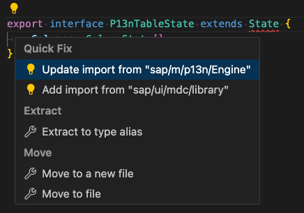

# Column Selection Controller and Popover
As the Table is now registered to the `Engine` and the `SelectionController` is assigned, you can start to enable the selection by adding the required state handling so that the `SelectionController` can show the proper state to the user.

## React to Personalization Changes
To be able to implement the desired behavior for personalization changes, the `Engine` provides the [`stateChange`](https://openui5nightly.hana.ondemand.com/api/sap.m.p13n.Engine#methods/attachStateChange) event. The event has the target control and the personalization state as parameters. To reflect the personalization changes on registered control instances, you need to attach to the according event in the `P13nTable#initP13n` method as follows:


````ts
private initP13n(): void {
	const columns: Column[] = this.getColumns()
	const columnsMetadata: MetadataObject[] = columns.map((column: Column, index: number) => {
		const columnHeader = column.getHeader() as Text
		const columnListItem: ColumnListItem = this.getItems()[0] as ColumnListItem
		const innerControl = columnListItem.getCells()[index]
		return {
			key: column.data("p13nKey"),
			label: columnHeader.getText(false),
			path: innerControl.getBinding(innerControl.isA("sap.m.ObjectIdentifier") ? "title" : "text").getPath()
		}
	})

	this.helper = new MetadataHelper(columnsMetadata)

	this.engine.register(this, {
		helper: this.helper,
		controller: {
			Columns: new SelectionController({
				control: this,
				targetAggregation: "columns",
				getKeyForItem: (column: Column) => {
					return column.data("p13nKey")
				}
			})
		}
	})

	this.engine.attachStateChange((event: Event) => {
		const parameters = event.getParameters() as any
		if (parameters["control"] === this) {
			this.onStateChange(parameters["state"])
		}
	})
}
````

Define the state interfaces at the end of the `P13nTable.ts` file for typescript usage.

````ts
export interface P13nTableState extends State {
	Columns: SelectionState[]
}
````

Also add the `State` type to the dependency import for `sap/m/p13n/Enginge`.



Or manually:

````ts
import Engine, { State } from "sap/m/p13n/Engine"
````

Afterwards add the `P13nTable#onStateChange` method. For now, just use a console log using `JSON#stringify` to take a look at the state object and how it is retrieved by the `Engine`.

````ts
public onStateChange(state: P13nTableState): void {
    console.log(JSON.stringify(state, null, 2))
}
````

Once you restart the application, use `F12` to open the debugger. Switch to the `console` tab of your browser. The state handling has been executed once and when you open the dialog and make changes, you can see how the `SelectionController` reports the state. You can also try to open the dialog, deselect an entry, and reselect it again. If you now close the Popup, you notice that no state change event has been fired. One of the central functionalties of the `SelectionController` is the state handling and detection of changes. This way, the `Engine` and `SelectionController` ensure, that events are only triggered when necessary changes have occured. The object looks similar to the following:

````json
{
  "Columns": [
    {
      "key": "prominence"
    },
    {
      "key": "range"
    },
    {
      "key": "coordinates"
    },
    {
      "key": "parent_mountain"
    },
    {
      "key": "first_ascent"
    },
    {
      "key": "countries"
    },
    {
      "key": "height"
    },
    {
      "key": "name"
    }
  ]
}
````

On the root level of the object you can again find the name you chose for the registration of the `SelectionController`.
It refers to an array, containing objects for each entry of the registered `SelectionController`, using the keys you defined in the `MetadataHelper`. The order in the array reflects the same position as in the dialog and only selected entries are returned in this state.

## Implement the Table-Specific Handling

Now that you understand the `stateChange` event, add some customized handling for toggling the visibility of the columns. In addition, you want to reorder the columns and table items according to the selection state. Therefore replace the log method in the `P13nTable#onStateChange`:

````ts
public onStateChange(state: P13nTableState): void {

	this.getColumns().forEach((column: Column) => {
		// if the column is not in the state, it is not visible
		column.setVisible(state.Columns.some((selectionState: SelectionState) => {
			return column.data("p13nKey") === selectionState.key
		}))
	})

	state.Columns.forEach(this.moveColum, this)
}

private moveColum(selectionState: SelectionState, index: number): void {
	const column: Column | undefined = this.getColumns().find((column: Column) => {
		return column.data("p13nKey") === selectionState.key
	})
	if (column === undefined) return
	const oldIndex: number = this.getColumns().indexOf(column)

	if (index != oldIndex) {
		this.removeColumn(column)
		this.insertColumn(column, index)

		const fnMoveCells = (columnListItem: ColumnListItem | undefined) => {
			if (columnListItem?.isA("sap.m.ColumnListItem")) {
				const cell: Control | null = columnListItem.removeCell(oldIndex)
				if (cell != null) columnListItem.insertCell(cell, index)
			}
		}
		const itemsBindingInfo: AggregationBindingInfo = this.getBindingInfo("items") as AggregationBindingInfo
		fnMoveCells(itemsBindingInfo.template as ColumnListItem | undefined)
		this.getItems().forEach((item) => fnMoveCells(item as ColumnListItem))
	}
}
````

>**Note:** This is just an example implementation of how this event may be used. You can decide, depending on the requirements, how you would like to react on the state changes done.

You will now notice that the `AggregationBindingInfo` type is not defined, therefore you need to add the import, you can use the QuickFix feature again as shown before or manually by adding:

```ts
import { AggregationBindingInfo } from "sap/ui/base/ManagedObject"
```

## Summary
The user is now able to add, remove and reorder columns using the button in the upper right corner of the application. Check out the example and adapt some personalization settings. You can observe, that the changes in the dialog are automatically reflected on the UI. If you are happy with the result, please proceed with [Exercise 5](../ex05/).
