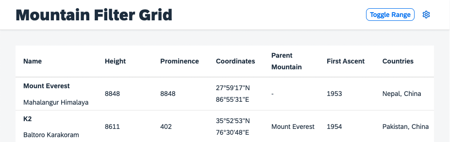

# Change the Control State
Although it might not be the most prominent scenario for your application, there could be a need to change a personalization enabled control's state programmatically. As mentioned before, it is not possible to do this with the control's standard API for aggregation management.

## Using the Engine State API
The `Engine` comes with two methods that allow for state alteration of managed aggregations, with promise return values.
* [`Engine#retrieveState`](https://openui5nightly.hana.ondemand.com/api/sap.m.p13n.Engine#methods/retrieveState): Allows you to retrieve the current state of a control and modify it.
* [`Engine#applyState`](https://openui5nightly.hana.ondemand.com/api/sap.m.p13n.Engine#methods/applyState): Allows you to provide a state with modifications that can be applied to the target control.

Usually you would use those two API as a couple. Retrieving the state in the current format and place your instructions in a declarative manner. That way the `Engine` can process the desired changes. First create the two methods, in case you would like to expose them as part of your custom `P13nTable`. You might not need to do that, but for learning purposes let us assume you do.

````ts
public async applyState(state: P13nTableState) {
	await this.initialized
	return this.engine.applyState(this, state)
}

public async retrieveState() {
	await this.initialized
	return this.engine.retrieveState(this)
}
````

Create a toggle button in the `Mountains.view.xml`:
````xml
<mvc:View
	height="100%"
	displayBlock="true"
	xmlns:mvc="sap.ui.core.mvc"
	xmlns="sap.m"
	xmlns:f="sap.f"
	xmlns:core="sap.ui.core"
	xmlns:ctl="sample.p13n.app.control"
	controllerName="sample.p13n.app.controller.Mountains"
	xmlns:sap.ui.fl="sap.ui.fl"
	xmlns:custom.data="http://schemas.sap.com/sapui5/extension/sap.ui.core.CustomData/1">

	<f:DynamicPage id="dynamicPageId">
		<f:title>
			<f:DynamicPageTitle>
				<f:heading>
					<Title text="Mountain Filter Grid"/>
				</f:heading>

				<f:actions>
					<ToggleButton
						id="toggleRangeButton"
						text="Toggle Range"
						press=".onToggleRange"
						type="Transparent"/>
					<Button
						id="p13nButton"
						icon="sap-icon://action-settings"
						type="Transparent"
						press=".onP13nPress"/>
				</f:actions>

			</f:DynamicPageTitle>
		</f:title>
````
Next you are going to use the state API to toggle the visibility of a column and move it to the first position. For this, we can use the newly created API of the `P13nTable` as follows.

>**Note**: As explained earlier, the object retrieved from the state API contains the current state. To change this the modifications need to be *added*. For example, if you want to hide a column from the current state, you explicitly need to set the visibility flag to false. If you want to move a column, you need to provide the position.


Ensure that the `MessageToast` and other necessary modules and types are required in the `Mountains.controller.ts` file.
````ts
import P13nTable, { P13nTableState } from "../control/P13nTable"
import ToggleButton from "sap/m/ToggleButton"
import MessageToast from "sap/m/MessageToast"
import { SelectionState } from "sap/m/p13n/SelectionController"
````

Add the following method to the `Mountains.controller.js`

````ts
public async onToggleRange(event: Event): Promise<void> {
	const p13nTable: P13nTable | undefined = this.byId("table") as P13nTable | undefined
	const pressed = (event.getSource() as ToggleButton).getPressed()
	const state: P13nTableState = await p13nTable.retrieveState() as P13nTableState
	const rangeColumnState = state.Columns.find((selectionState: SelectionState) => {
		return selectionState.key == RANGE_COLUMN_KEY
	})
	if (pressed && rangeColumnState) {
		rangeColumnState.visible = false
		MessageToast.show("Range hidden")
	} else {
		state.Columns.push({key: RANGE_COLUMN_KEY, index: 0})
		MessageToast.show("Range shown")
	}
	p13nTable.applyState(state)
}
````

In addition define the static key that we want to toggle:
````ts
[...]

const RANGE_COLUMN_KEY = 'range'

/**
 * @namespace sample.p13n.app.controller
 */
export default class MountainsController extends Controller {

[...]
````

Once these steps have been implemented, you can now toggle the `Range` column using the `Engine` state APIs.



This becomes handy once we start to handle the persistency of the personalization functionality, which are explained in a later step of this tutorial.

## Summary
You have learned how to modify the state of a Control using the `Engine` and its state API. You have understood, that the state passed from `retrieveState` is the current state of the control that can be altered with instructions of what should change and passed to `applyState`. Go on with [Exercise 8](../ex08/).