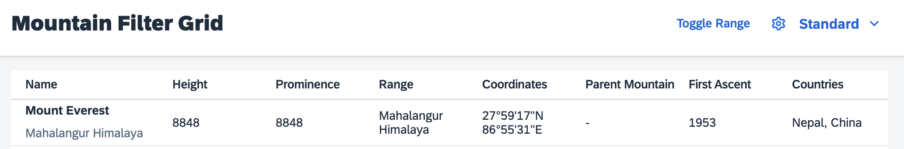
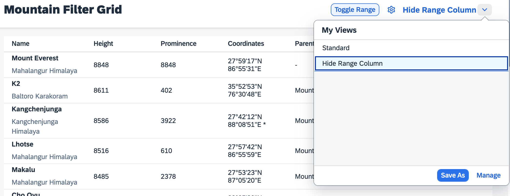

# VariantManagement
In case you wondered, how the personalization settings are persisted, so that users can come back to their favorite presets at a later point in time, this exercise provides the answer. You can integrate the `sap.ui.fl.variants.VariantManagement` into the application. If you want to know more what a Variant Management can do, please see the [official documentation](https://experience.sap.com/fiori-design-web/variant-management/).
# Include the VariantManagement
To be able to run the `VariantManagement` you need to include the required dependency to the `sap.ui.fl` library and add the variant management to the view. The variant management also needs a reference to the controls, that should be managed. You can find further details about the enablement of your application with SAPUI5 flexibility [here](https://sapui5.hana.ondemand.com/#/topic/f1430c0337534d469da3a56307ff76af) - this description will guide you through necessary prerequisites.
````xml
<mvc:View
	height="100%"
	displayBlock="true"
	xmlns:mvc="sap.ui.core.mvc"
	xmlns="sap.m"
	xmlns:f="sap.f"
	xmlns:core="sap.ui.core"
	xmlns:ctl="sample.p13n.app.control"
	controllerName="sample.p13n.app.controller.Mountains"
	xmlns:sap.ui.fl="sap.ui.fl"
	xmlns:vm="sap.ui.fl.variants"
	xmlns:custom.data="http://schemas.sap.com/sapui5/extension/sap.ui.core.CustomData/1">

	<f:DynamicPage id="dynamicPageId">
		<f:title>
			<f:DynamicPageTitle>
				<f:heading>
					<Title text="Mountain Filter Grid"/>
				</f:heading>

				<f:actions>
					<ToggleButton
						id="toggleRangeButton"
						text="Toggle Range"
						press=".onToggleRange"
						type="Transparent"/>
					<Button
						id="p13nButton"
						icon="sap-icon://action-settings"
						type="Transparent"
						press=".onP13nPress"/>
					<vm:VariantManagement id="vm" for="table"/>
				</f:actions>

			</f:DynamicPageTitle>
		</f:title>
````

Once the `VariantManagement` control has been added, you can it in the upper right corner of the application next to the buttons:



Now give it a try and see that all of the personalization options that have been enabled through this workshop are now persisted using the `VariantManagement`, as soon as you create or save them as a new view.



## Summary
This was the last exercise of the workshop, we hope you enjoyed it and are happy with the provided know how and functionality. In the final state of the application you can see, that by using the `Engine` approach you are spared a lot of the coding you would have to provide to create an own persistency. The `Engine` approach manages the integration into SAPUI5 flexibility, provides the personalization UI accordinng to the latest UX guidelines via a comparably easy to use interface. Please let us know your feedback or ideas regarding how we could make this even more usable in the future.

You can checkout the optional exercise where we build a custom filtering control [Exercise 9](../ex09/).