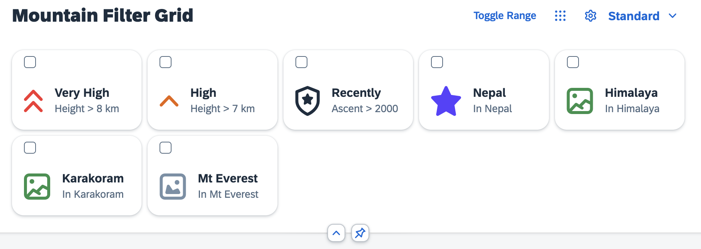
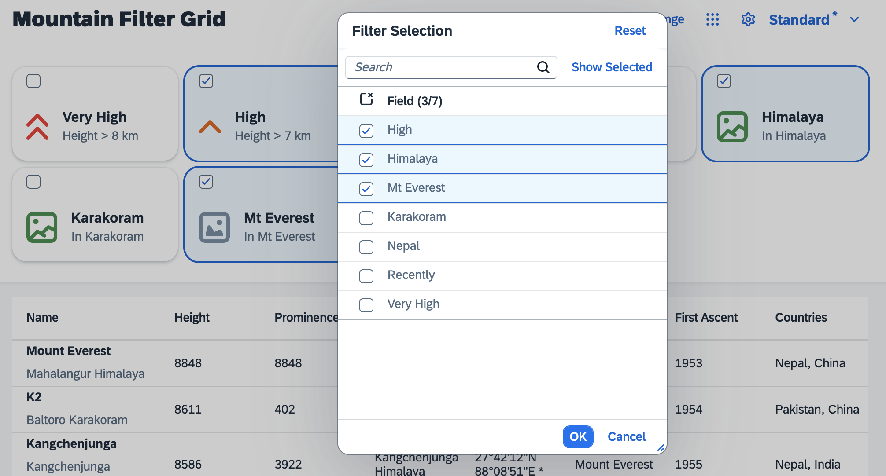

# Grid Filter Control
A very usual thing to do when working with tables is the demand to look for items of certain properties. Naturally you would like to filter the list for those. This is what you are going to implement in this exercise.

## The Filter Metadata
Have a look at the `filters` file:

````json
{ "filters": [
	{
		"label": "Very High",
		"description": "Height > 8 km",
		"expression": [
			"height",
			"GT",
			8000
		],
		"icon": "sap-icon://collapse-group",
		"color": "Negative"
	},
	{
		"label": "High",
		"description": "Height > 7 km",
		"expression": [
			"height",
			"GT",
			7000
		],
		"icon": "sap-icon://navigation-up-arrow",
		"color": "Critical"
	}

	// ...

]}
````

There are labels, descriptions and filter expressions already predefined and maintained in the `filterModel` of the application. Add the `GridList` control as dependency and add it to the `DynamicPageHeader`. Bind it to the filter model as shown:

````xml
<f:DynamicPageHeader pinnable="true">
	<f:GridList
		id="gridFilter"
		items="{filters>/filters}"
		mode="MultiSelect"
		includeItemInSelection="true"
		sap.ui.fl:flexibility="sap/m/flexibility/EngineFlex">
		<f:GridListItem type="Active">
			<HBox class="sapUiSmallMarginTopBottom">
				<core:Icon
					src="{filters>icon}"
					color="{filters>color}"
					size="2.5rem"
					class="sapUiSmallMarginBeginEnd"/>
				<VBox class="sapUiSmallMarginEnd">
					<Title text="{filters>label}"/>
					<Label text="{filters>description}"/>
				</VBox>
			</HBox>
		</f:GridListItem>
	</f:GridList>
</f:DynamicPageHeader>
````
The application should look like this now:




You may have noticed, that this control offers a multi selection functionality, but does not yet include any handling for selecting the different grid tiles. You can use the selection of this list, to create filter expressions for the table in the next steps.

## GridList Engine Registration

Similar to before, register the `GridList` to the `Engine` so that it can benefit from personalization related functionality. Only that this time you implement a different interpretation of the state handling result to demonstrate the capabilites and use cases of the `Engine`. Add the following module dependencies in the `Mountains.controller.ts` file:

````ts
import Engine, { State } from "sap/m/p13n/Engine"
import GridList from "sap/f/GridList"
import MetadataHelper, { MetadataObject } from "sap/m/p13n/MetadataHelper"
import GridListItem from "sap/f/GridListItem"
import JSONModel from "sap/ui/model/json/JSONModel"
import Control from "sap/ui/core/Control"
````

Also add `SelectionController` to the `SelectionState` import:
````ts
import SelectionController, { SelectionState } from "sap/m/p13n/SelectionController"
````

Initialize the grid filter by implementing a `initGridFilter` method:

````ts
export default class MountainsController extends Controller {

	private engine: Engine

	public onInit(): void {
		this.engine = Engine.getInstance()
		this.initGridFilter()
	}

	private initGridFilter(): void {
		const gridList = this.byId("gridFilter") as GridList
		const filterModel = gridList.getModel("filters") as JSONModel

		const aFilterMetadata: MetadataObject[] = gridList.getItems().map((gridListItem, index: number) => {
			return {
				path: "",
				key: gridListItem.getId(),
				label: filterModel.getData().filters[index].label
			}
		})

		const filterHelper = new MetadataHelper(aFilterMetadata)

		this.engine.register(gridList, {
			helper: filterHelper,
			controller: {
				Items: new SelectionController({
					control: gridList,
					targetAggregation: "items",
					getKeyForItem: (gridListItem: GridListItem) => {
						return gridListItem.getSelected()
					}
				})
			}
		})

		this.engine.attachStateChange(this.onP13nStateChange.bind(this))
	}

	public onP13nPress(event: Event): void {
		[...]
	}

	public async onToggleRange(event: Event): Promise<void> {
		[...]
	}

}
````

And add the new `onP13nStateChange` method:
````ts
private onP13nStateChange(event: Event): void {
	const parameters = event.getParameters() as {
		control: Control,
		state: MountainsControllerState
	}
	const state: MountainsControllerState = parameters.state
	const gridList = this.byId("gridFilter") as GridList

	if (parameters.control === gridList) {
		gridList.getItems().forEach((gridListItem: GridListItem) => {
			gridListItem.setSelected(state.Items.some((selectionState: SelectionState) => {
				return gridListItem.getId() === selectionState.key
			}))
		})
	}
}
````

Define the `MountainsControllerState` at the end of the `Mountains.controller.ts` file:
````ts
interface MountainsControllerState extends State {
	Items: SelectionState[]
}
````

The grid filter is now ready for personalization using the `Engine`. This time, a different state handling was implemented. Note that `Items` is the registered name for our `SelectionController`. This time use the selection state to create filters for the table. Use the `Engine#show` method to open the selection dialog:

````ts
public onGridFilterPress(event: Event): void {
	const gridList = this.byId("gridFilter") as GridList
	this.engine.show(gridList, ["Items"], {
		title: "Filter Selection",
		source: event.getSource()
	})
}
````

Attach the according event handler through a new button in the `Mountains.view.xml` and add `GridFilter` to the `VariantManagement`:
````xml
<mvc:View
	height="100%"
	displayBlock="true"
	xmlns:mvc="sap.ui.core.mvc"
	xmlns="sap.m"
	xmlns:f="sap.f"
	xmlns:core="sap.ui.core"
	xmlns:ctl="sample.p13n.app.control"
	controllerName="sample.p13n.app.controller.Mountains"
	xmlns:sap.ui.fl="sap.ui.fl"
	xmlns:vm="sap.ui.fl.variants"
	xmlns:custom.data="http://schemas.sap.com/sapui5/extension/sap.ui.core.CustomData/1">

	<f:DynamicPage id="dynamicPageId">
		<f:title>
			<f:DynamicPageTitle>
				<f:heading>
					<Title text="Mountain Filter Grid"/>
				</f:heading>

				<f:actions>
					<ToggleButton
						id="toggleRangeButton"
						text="Toggle Range"
						press=".onToggleRange"
						type="Transparent"/>
					<Button
						id="gridFilterButton"
						icon="sap-icon://grid"
						type="Transparent"
						press=".onGridFilterPress"/>
					<Button
						id="p13nButton"
						icon="sap-icon://action-settings"
						type="Transparent"
						press=".onP13nPress"/>
					<vm:VariantManagement id="vm" for="table,gridFilter"/>
				</f:actions>

			</f:DynamicPageTitle>
		</f:title>
````

Restart the application and observe an additional button in the upper right corner, which opens a selection dialog. This time not to toggle the visibility of columns but to toggle the selection status of the items in the `GridList` and to create filter objects accordingly.


## Summary
We now have a nice Grid List control, that should serve as a Filter for the table. In the next step you will learn how to enable filtering via the `Engine` Selection Controller. Continue with [Exercise 10](../ex10/).