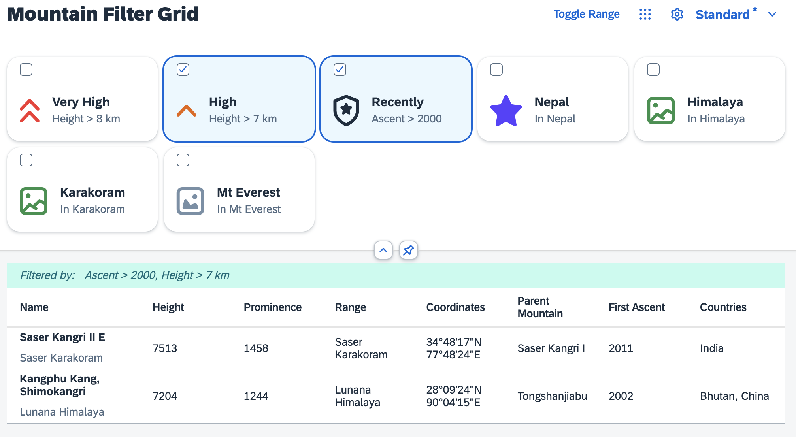

# Filter via Selection Controller
This exercise shows how to introduce some static filters and how their selection can be made part of the personalization and managed by the `SelectionController`. Furthermore the grid list should be enabled to react on tile clicks by using the `Engine` state API.

## Create Filters on State Change
First add missing dependencies in `Mountains.controller.ts`:
````ts
import Element from "sap/ui/core/Element"
import Filter from "sap/ui/model/Filter"
import ListBinding from "sap/ui/model/ListBinding"
import ListItemBase from "sap/m/ListItemBase"
````

Update the binding by adding the filters that can be created from the filter model.
````ts
private onP13nStateChange(event: Event): void {
	const parameters = event.getParameters() as {
		control: Control,
		state: MountainsControllerState
	}
	const state: MountainsControllerState = parameters.state
	const gridList = this.byId("gridFilter") as GridList

	if (parameters.control === gridList) {
		gridList.getItems().forEach((gridListItem: GridListItem) => {
			gridListItem.setSelected(state.Items.some((selectionState: SelectionState) => {
				return gridListItem.getId() === selectionState.key
			}))
		})

		const filters: Filter[] = []
		let filterText: string
		state.Items.forEach((selectionState: SelectionState) => {
			const item: GridListItem | undefined = Element.getElementById(selectionState.key) as GridListItem | undefined
			if (item) {
				const filterContext = item.getBindingContext("filters")
				const expression: any[] = filterContext.getProperty("expression")
				const description: string = filterContext.getProperty("description")
				filters.push(new Filter(expression[0], expression[1], expression[2]))
				filterText = filterText ? filterText + ", " + description : description
			}
		})
		const table: P13nTable = this.byId("table") as P13nTable
		const tableBinding = table.getBinding("items") as ListBinding
		tableBinding.filter(filters)
		table.setFilterInfoText(filterText)
	}
}
````
And change the selector of the controller registration, to respect the actual filter state:
````ts
this.engine.register(gridList, {
	helper: filterHelper,
	controller: {
		Items: new SelectionController({
			control: gridList,
			targetAggregation: "items",
			getKeyForItem: (gridListItem: GridListItem) => {
				const listBinding = this.byId("table").getBinding("items") as ListBinding
				return listBinding.getFilters("Control").some((filter: Filter) => {
					const expression: string[] = gridListItem.getBindingContext("filters").getProperty("expression")
					return filter.getPath() === expression[0]
						&& filter.getValue1() === expression[2]
				})
			}
		})
	}
})
````

## Enable the Grid List Selection
At this point you might have noticed, that the clicks on the tiles of the grid list do not work as expected. That is because their status change is not yet recognized by the `Engine`. As explained earlier, a direct modification of the aggregation might lead to inconsistencies. Add an event handler for the grid list selection:
````ts
public onGridFilterSelect(event: Event): void {
	const gridList = this.byId("gridFilter") as GridList
	const parameters = event.getParameters() as {
		listItem : ListItemBase,
		listItems : ListItemBase[],
		selected : boolean,
		selectAll: boolean
	}
	const item = parameters.listItem as GridListItem
	this.engine.retrieveState(gridList).then((state: MountainsControllerState) => {
		const itemId = item.getId()

		const oStateItem = state.Items.find((selectionState: SelectionState) => {
			return selectionState.key == itemId
		})

		if (item.getSelected()) {
			state.Items.push({key: itemId})
		} else {
			oStateItem.visible = false
		}

		this.engine.applyState(gridList, state)
	})
}
````
In `Mountains.view.xml` you can attach the event handler, so that it is called on the `selectionChange` event of the `GridList` control:

````xml
<f:GridList
	id="gridFilter"
	items="{filters>/filters}"
	mode="MultiSelect"
	includeItemInSelection="true"
	sap.ui.fl:flexibility="sap/m/flexibility/EngineFlex"
	selectionChange=".onGridFilterSelect">
	<f:GridListItem type="Active">
		<HBox class="sapUiSmallMarginTopBottom">
			<core:Icon
				src="{filters>icon}"
				color="{filters>color}"
				size="2.5rem"
				class="sapUiSmallMarginBeginEnd"/>
			<VBox class="sapUiSmallMarginEnd">
				<Title text="{filters>label}"/>
				<Label text="{filters>description}"/>
			</VBox>
		</HBox>
	</f:GridListItem>
</f:GridList>
````

Now you can try filtering of the table. The result set should only show, what you defined via the grid filter:



## Summary
You have learned how to apply a filter with the Grid List that is integrated with the `Engine`. You should be able to see, how the table is being filtered in the running application.