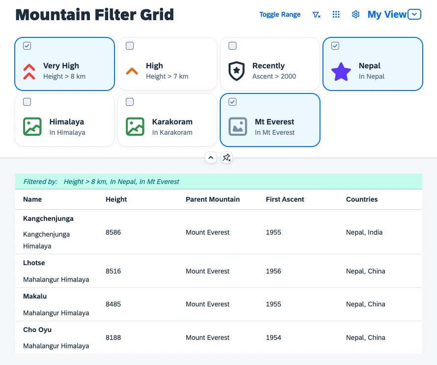

# P13nify Everything - Personalization for Any Control

## Description
In this tutorial you can learn how to add personalization capabilities to almost every control. If you have a custom control that you would like to enhance with filtering, sorting, or other options this tutorial is for you.

You will be lead through the enablement of a custom control using the assets provided by UI5. You can also learn, how to use those assets to enhance your application with personalization capabilities. You should be able to apply your knowledge afterwards in your own application or control development.

### UI5 Components in Focus
* [`sap.m.p13n.Engine`](https://sdk.openui5.org/api/sap.m.p13n.Engine)
* [`sap.ui.fl.variants.VariantManagement`](https://sdk.openui5.org/api/sap.ui.fl.variants.VariantManagement)

## Exercises
1. [Setup the Application](exercises/ex01/)
1. [Custom Table for P13n](exercises/ex02/) (*[sources](/exercises/ex02/sample.p13n/), [run app](https://sap-samples.github.io/ui5-p13n-tutorial/exercises/ex02/sample.p13n/dist)*)
1. [Engine Registration](exercises/ex03/) (*[sources](/exercises/ex03/sample.p13n/), [run app](https://sap-samples.github.io/ui5-p13n-tutorial/exercises/ex03/sample.p13n/dist)*)
1. [Column Selection](exercises/ex04/) (*[sources](/exercises/ex04/sample.p13n/), [run app](https://sap-samples.github.io/ui5-p13n-tutorial/exercises/ex04/sample.p13n/dist)*)
1. [Sorting and Grouping](exercises/ex05/) (*[sources](/exercises/ex05/sample.p13n/), [run app](https://sap-samples.github.io/ui5-p13n-tutorial/exercises/ex05/sample.p13n/dist)*)
1. [Filtering & Info Toolbar](exercises/ex06/) (*[sources](/exercises/ex06/sample.p13n/), [run app](https://sap-samples.github.io/ui5-p13n-tutorial/exercises/ex06/sample.p13n/dist)*)
1. [Changing Control State](exercises/ex07/) (*[sources](/exercises/ex07/sample.p13n/), [run app](https://sap-samples.github.io/ui5-p13n-tutorial/exercises/ex07/sample.p13n/dist)*)
1. [VariantManagement](exercises/ex08/) (*[sources](/exercises/ex08/sample.p13n/), [run app](https://sap-samples.github.io/ui5-p13n-tutorial/exercises/ex08/sample.p13n/dist)*)
1. [(optional) Custom Filter Control](exercises/ex09/) (*[sources](/exercises/ex09/sample.p13n/), [run app](https://sap-samples.github.io/ui5-p13n-tutorial/exercises/ex09/sample.p13n/dist)*)
1. [(optional) Filtering with GridList](exercises/ex10/) (*[sources](/exercises/ex10/sample.p13n/), [run app](https://sap-samples.github.io/ui5-p13n-tutorial/exercises/ex10/sample.p13n/dist)*)

## Final Application
This is the application you build during the tutorial:

[Have a look now!](https://sap-samples.github.io/ui5-p13n-tutorial/exercises/ex11/sample.p13n/dist)

## Requirements
### Technical Requirements
* A current version of [Node.js](https://nodejs.org/) (preferably 18+)
* A code editor supporting TypeScript development
### Required Knowledge
* TypeScript knowledge to avoid blind copy and paste without knowing what's going on.
* UI5 knowledge, as this tutorial focuses on the P13n concepts.

## Known Issues
No known issues.

## How to obtain support
This repository is provided as-is, without any support guarantees. However, you are welcome to report issues via the [Issues](../../issues) tab and we'll see what we can do to fix them.

## Contributing
If you wish to contribute code, offer fixes or improvements, please send a pull request. Due to legal reasons, contributors will be asked to accept a DCO when they create the first pull request to this project. This happens in an automated fashion during the submission process. SAP uses [the standard DCO text of the Linux Foundation](https://developercertificate.org/).

## License
Copyright (c) 2023 SAP SE or an SAP affiliate company. All rights reserved. This project is licensed under the Apache Software License, version 2.0 except as noted otherwise in the [LICENSE](LICENSE) file.